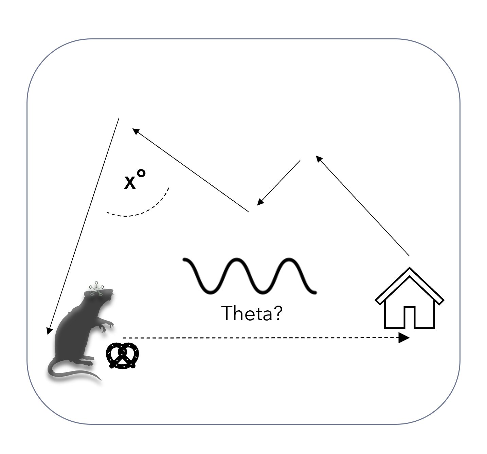

<div id="top"></div>
<!--

-->


<!-- PROJECT SHIELDS -->
<!--

-->
[![Contributors][contributors-shield]][contributors-url]
[![Forks][forks-shield]][forks-url]
[![Stargazers][stars-shield]][stars-url]
[![Issues][issues-shield]][issues-url]
[![MIT License][license-shield]][license-url]
[![LinkedIn][linkedin-shield]][linkedin-url]


<!-- PROJECT LOGO -->
<br />
<div align="center">
  <a href="https://github.com/Fabalinks/Multiple_trial_analysis">
    
  </a>

<h3 align="center">Straightness analysis</h3>

  <p align="center">
    Dedicated to analyzing rearign behavior in rats in Ratcave VR
    <br />
  </p>
</div>


<!-- TABLE OF CONTENTS -->
<details>
  <summary>Table of Contents</summary>
  <ol>
    <li>
      <a href="#about-the-project">About The Project</a>
      <ul>
    </li>
    <li>
      <a href="#getting-started">Getting Started</a>
      <ul>
        <li><a href="#installation">Installation</a></li>
      </ul>
    </li>
    <li><a href="#data-description">Data Description</a></li>
    <li><a href="#contributing">Contributing</a></li>
    <li><a href="#license">License</a></li>
    <li><a href="#contact">Contact</a></li>
    <li><a href="#acknowledgments">Acknowledgments</a></li>
  </ol>
</details>


<!-- ABOUT THE PROJECT -->
## About The Project

<br />
<div align="center">
  <a href="https://github.com/Fabalinks/Multiple_trial_analysis">
    
  </a>
</div>


Research to uncover the neural basis behind Path integration.
In this project we use virtual reality with freely moving rodents while recording
electrophysiological signal from the Hippocampus CA1.
Animals are taught to rear at a visible beacon in the virtual arena,
retrieve a randomly distributed reward and go back to the original location
where the beacon was, but this time in darkness. We focus on understanding
how the animal accumulates vectors as it travels to the reward and then
when it needs to retrieve/calculate a correct vector to the original location.
In this analysis we focus on proving the rearing behavior at the beacon.


<p align="right">(<a href="#top">back to top</a>)</p>


<!-- GETTING STARTED -->
### Installation

 * pip
  ```sh
  pip install https://github.com/Fabalinks/Multiple_trial_analysis
  ```

<p align="right">(<a href="#top">back to top</a>)</p>


<!-- Data Description -->
## Data description

During an experimental session 4 files are generated. Each is a text file and contains columns seperated by space. 

position datetime.txt (rotation in quaternion coordinates):

The coordinates are established in the experimental room. When entering the room facing away from the door, X position would be to the right and left of the door (short wall of the arena). The rotation around this axis would be the pitch of the animal. The Z Position is then the second column taken as up and down in height in the room coordinates and the respective rotation around this is the yaw of the animal. With the last position axis the Y rat position would be going futher into the room axis (long arena wall). Hence the rotation around this axis would be the roll of the animal.


| Time     | X rat | Z rat (height) | Y rat |  rotation_around Y (roll) | rotation_around Z (yaw) | rotation_around X (pitch)| Motive Frame|Motive timestamp|Motive session timestamp|
| ----------- | ----------- | ----------- | ----------- | ----------- | ----------- | ----------- | ----------- | ----------- | ----------- |

beacons_entry.txt (historical): Denotes each time the rat entered the beacon and keeps track of the animal untill it exits and records the amount of time the animal spent in the beacon.

 | Time     | X rat | Z rat (height) | Y rat | X beacon | Y beacon| time in beacon|
 | ----------- | ----------- | ----------- | ----------- | ----------- | ----------- |----------- |
 
beacons datetime.txt: Record the trigger of the beacon by the rat.

 | Time     | X rat | Z rat (height) | Y rat | X beacon | Y beacon|
 | ----------- | ----------- | ----------- | ----------- | ----------- | ----------- |

metadata date - time.txt :  Example described


|Recording started on :| 2021-11-15 16:04:08  |
| ------------- | ----------- |
Computer time was : |1636988648.44  s
ITI_time : |1.5   # (s) time after beacon that beacon is inactive (animal cannot just stand there getting beacons, needs to leave
time_in_cylinder : |60  # (s) required time for animal to stay in beacon - if high number, animal needs ot rear for trigger
movement_collection_time :| 0.01  # getting position data supposedly at 100hz.
animal_ID : |FS11  
background_color : |000   # just black color on the background
circle : |0.075  # (m) radius of visible beacon presented
position_change : |10  # how many beacons till position changes
light_off : |2  # how many beacons till beacon is invisible. If high number = training (always visible)- if 2 evryo toher time invisible
Cylinder_color : |grass.png  
rotation : |80  #rotation speed for visual perturbation
Pellets : |96   # rewards or trials achieved durign task
Beacon : |217.640997887 # (s) time spent in beacon
Sham : |104.490000248 # (s) time spent in beacon which is in different place and never visible.
Distance : |498.117148451  # in meters
Speed : |31.793808940176444 # cm/s
recording lenght : |1892.398 # (s)
high pellets : |95  # how many pellets were achieved by standing
high_time_in_cylinder : |0.5 # (s) for how long animal has to rear in cylinder to count.
invisible_time : |60 # (s) how long does animal has before beacon becomes visible (time to achieve trial) 
invisible_count : |38 # how many invisible beacons animal achieved
invisible_list : |[1, 3, 5, 7, 9, 11, 13, 15, 17, 19, 23, 31, 33, 35, 37, 39, 41, 43, 45, 47, 49, 51, 53, 55, 57, 61, 65, 67, 71, 73, 75, 77, 83, 85, 87, 89, 93, 95]  # which beacon number were the invisible ones.
Animal jumped : |-1  # how many times did the animal jump?
Recording_started_motive : |0  # Motive - ephys frame number
Recording_timestamp_motive : |0.0 # Motive ephys timestamp
Day : |157 # Which script
invisible circle : |0.15  #(m)how large is the invisible beacon area


<p align="right">(<a href="#top">back to top</a>)</p>


<!-- CONTRIBUTING -->
## Contributing

1. Fork the Project
2. Create your Feature Branch (`git checkout -b analysis/New_stuff`)
3. Commit your Changes (`git commit -m 'Add some New_stuff'`)
4. Push to the Branch (`git push origin analysis/New_stuff`)
5. Open a Pull Request

<p align="right">(<a href="#top">back to top</a>)</p>


<!-- LICENSE -->
## License

Distributed under the Apache License. See `LICENSE.txt` for more information.

<p align="right">(<a href="#top">back to top</a>)</p>


<!-- CONTACT -->
## Contact

Fabian Stocek - [@fabalinks](https://twitter.com/@fabalinks) - stocek@bio.lmu.de

Project Link: [https://github.com/Fabalinks/Multiple_trial_analysis](https://github.com/Fabalinks/Multiple_trial_analysis)

<p align="right">(<a href="#top">back to top</a>)</p>


<!-- ACKNOWLEDGMENTS -->
## Acknowledgments

* [Sirota lab](https://cogneuro.bio.lmu.de/people/group-members/sirota/index.html)
* [ Funding - RTG 2175](https://www.rtg2175.bio.lmu.de/index.html)
* [Jin Lee](https://github.com/jinhl9)

<p align="right">(<a href="#top">back to top</a>)</p>


<!-- MARKDOWN LINKS & IMAGES -->
<!-- https://www.markdownguide.org/basic-syntax/#reference-style-links -->
[contributors-shield]: https://img.shields.io/github/contributors/Fabalinks/Multiple_trial_analysis.svg?style=for-the-badge
[contributors-url]: https://github.com/Fabalinks/Multiple_trial_analysis/graphs/contributors
[forks-shield]: https://img.shields.io/github/forks/Fabalinks/Multiple_trial_analysis.svg?style=for-the-badge
[forks-url]: https://github.com/Fabalinks/Multiple_trial_analysis/network/members
[stars-shield]: https://img.shields.io/github/stars/Fabalinks/Multiple_trial_analysis.svg?style=for-the-badge
[stars-url]: https://github.com/Fabalinks/Multiple_trial_analysis/stargazers
[issues-shield]: https://img.shields.io/github/issues/Fabalinks/Multiple_trial_analysis.svg?style=for-the-badge
[issues-url]: https://github.com/Fabalinks/Multiple_trial_analysis/issues
[license-shield]: https://img.shields.io/github/license/Fabalinks/Multiple_trial_analysis.svg?style=for-the-badge
[license-url]: https://github.com/Fabalinks/Multiple_trial_analysis/blob/master/LICENSE.txt
[linkedin-shield]: https://img.shields.io/badge/-LinkedIn-black.svg?style=for-the-badge&logo=linkedin&colorB=555
[linkedin-url]: https://www.linkedin.com/in/fabian-stocek/
[product-screenshot]: images/screenshot.png
